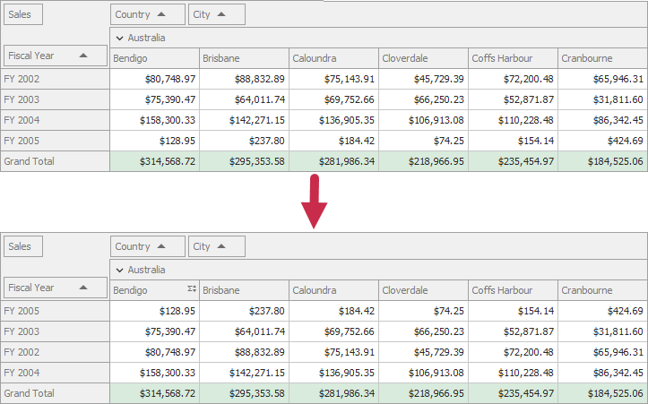

<!-- default badges list -->

<!-- default badges end -->

# Pivot Grid for WinForms - Implement Sorting by Summary in OLAP Mode

The following example demonstrates how to implement sorting by summary in OLAP mode. In this example, values of the _Fiscal Year_ field are sorted by the _Australia_ | _Bendigo_ column summary values.

 Two `PivotGridFieldSortCondition` objects contain OLAP members that correspond to `Australia` and `Bendigo` values. The `PivotGridControl.GetFieldValueOLAPMember` methods obtain these values. Obtained values specify columns by which the _Fiscal Year_ field should be sorted and are stored in the _Fiscal Year_'s `PivotGridFieldBase.SortBySummaryInfo.Conditions` collection. OLAP members can be obtained only for visible field values. For this reason, the Australia field value is expanded before initializing OLAP members to obtain the _Bendigo_ member. The `PivotGridFieldBase.SortBySummaryInfo.Field` property specifies the data field whose summary values should be used to sort values of the Fiscal Year field.

## Files to Review

* [Form1.cs](./CS/XtraPivotGrid_OLAPSortBySummary/Form1.cs) (VB: [Form1.vb](./VB/XtraPivotGrid_OLAPSortBySummary/Form1.vb))

## Documentation

- [Filter by Summaries](https://docs.devexpress.com/WindowsForms/11545/controls-and-libraries/pivot-grid/data-shaping/filtering/filter-by-summaries)
- [Summaries](https://docs.devexpress.com/WindowsForms/9384)
- [Levels of Details](https://docs.devexpress.com/WindowsForms/1796/controls-and-libraries/pivot-grid/fundamentals/hierarchical-value-presentation#use-resulting-detail-levels)

## More Examples

[Pivot Grid for WinForms - Apply Summary Filter](https://github.com/DevExpress-Examples/winforms-pivot-apply-summary-filter) 

<!-- feedback -->
## Does this example address your development requirements/objectives?

 

(you will be redirected to DevExpress.com to submit your response)
<!-- feedback end -->
